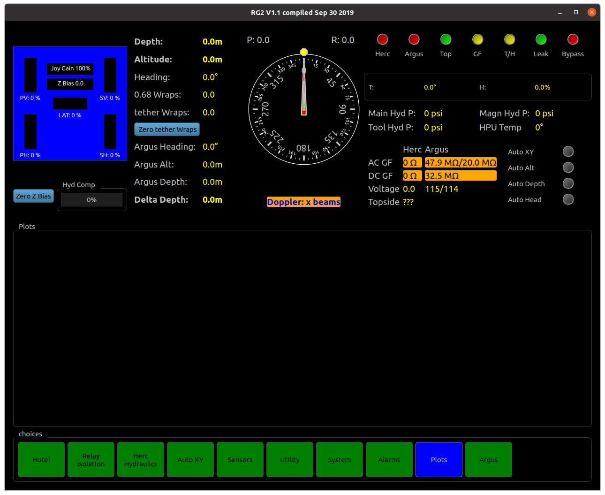
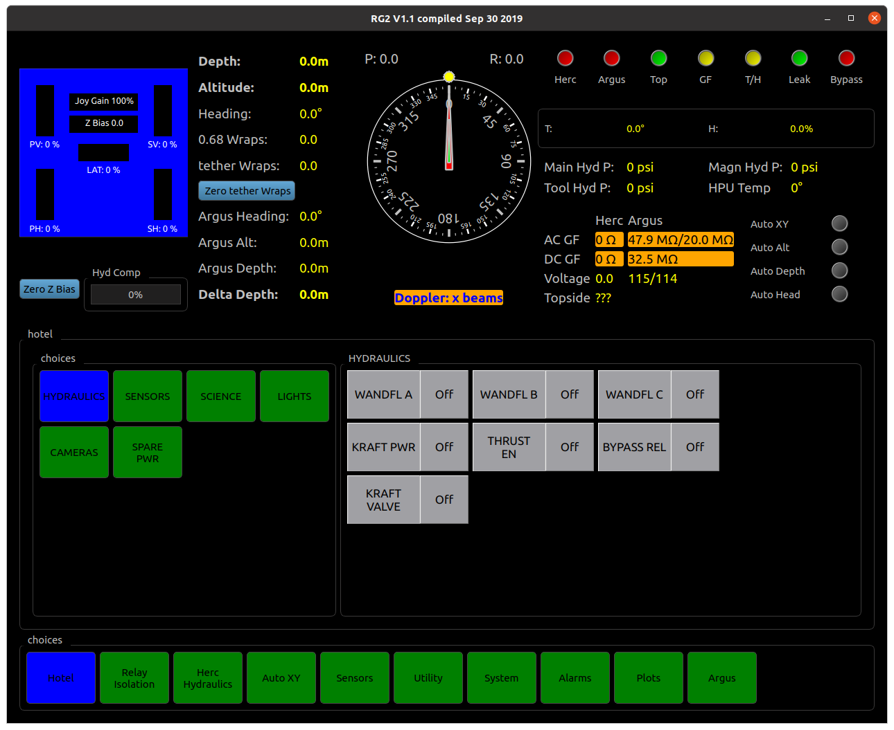
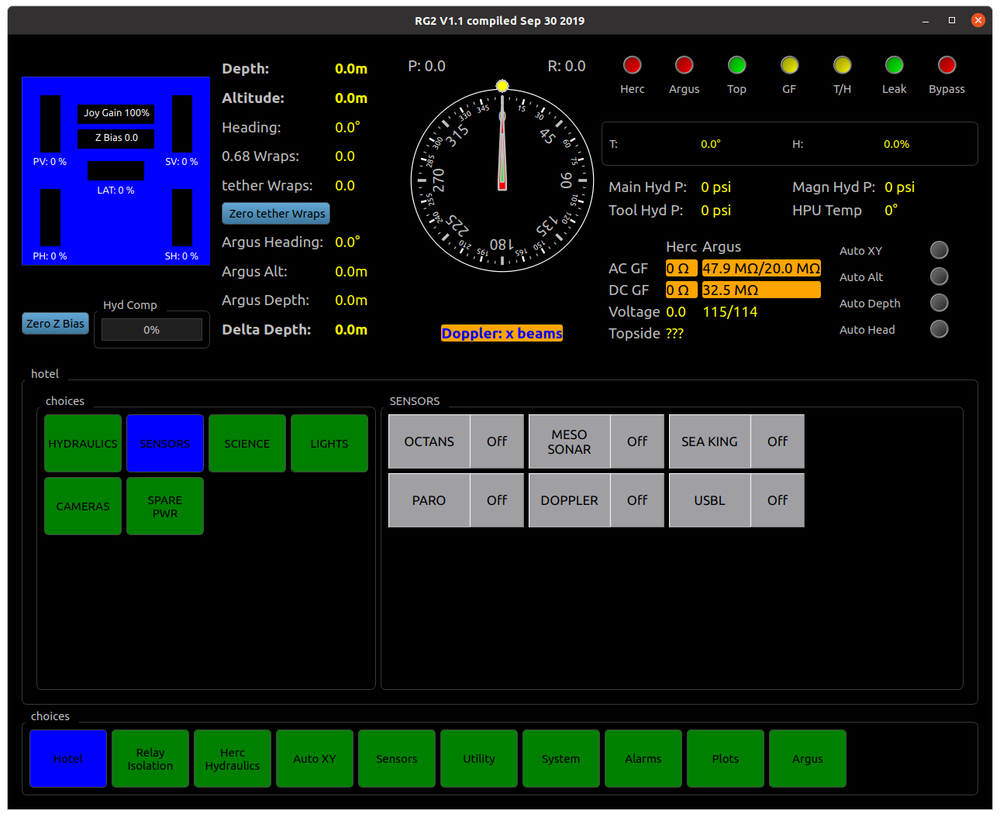
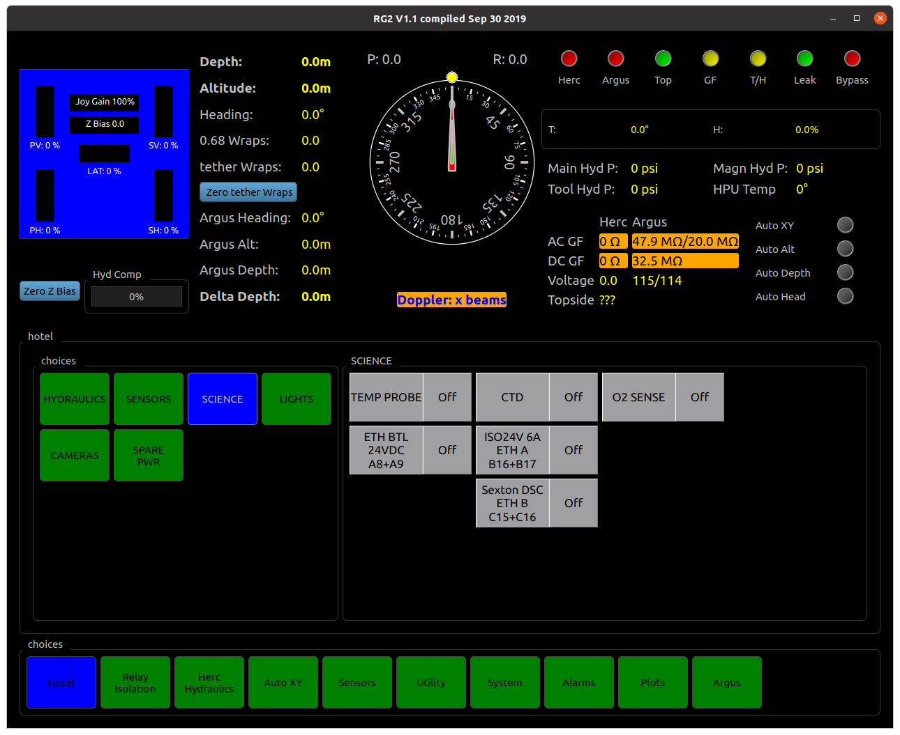
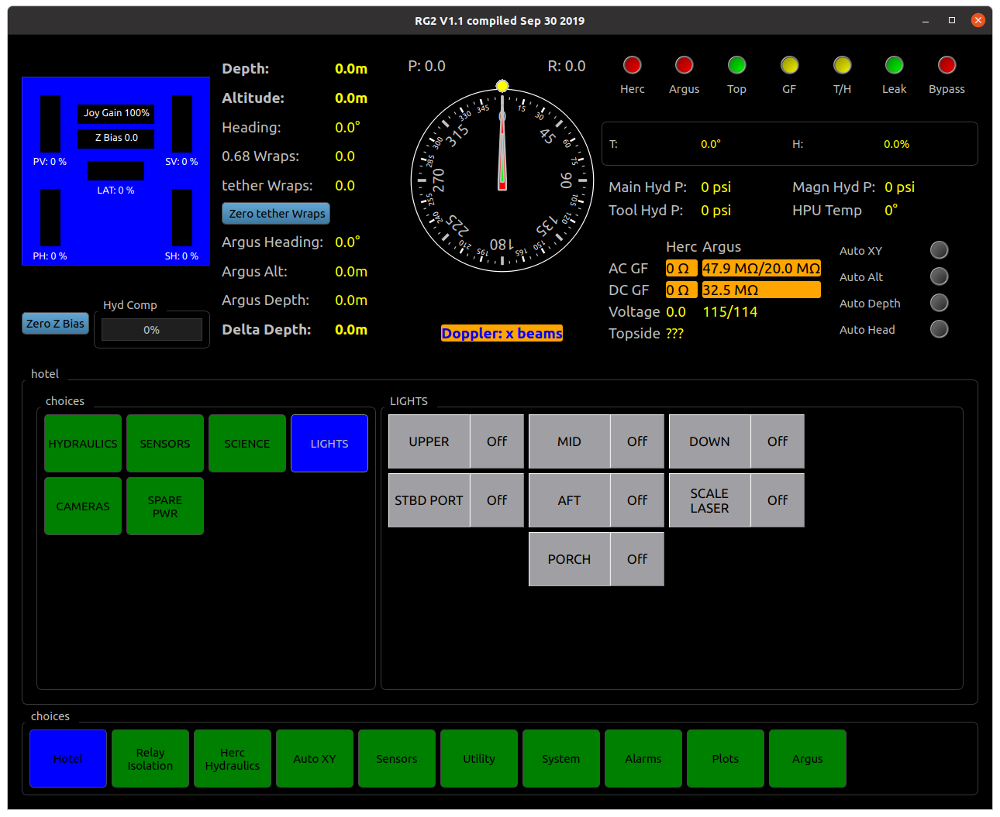
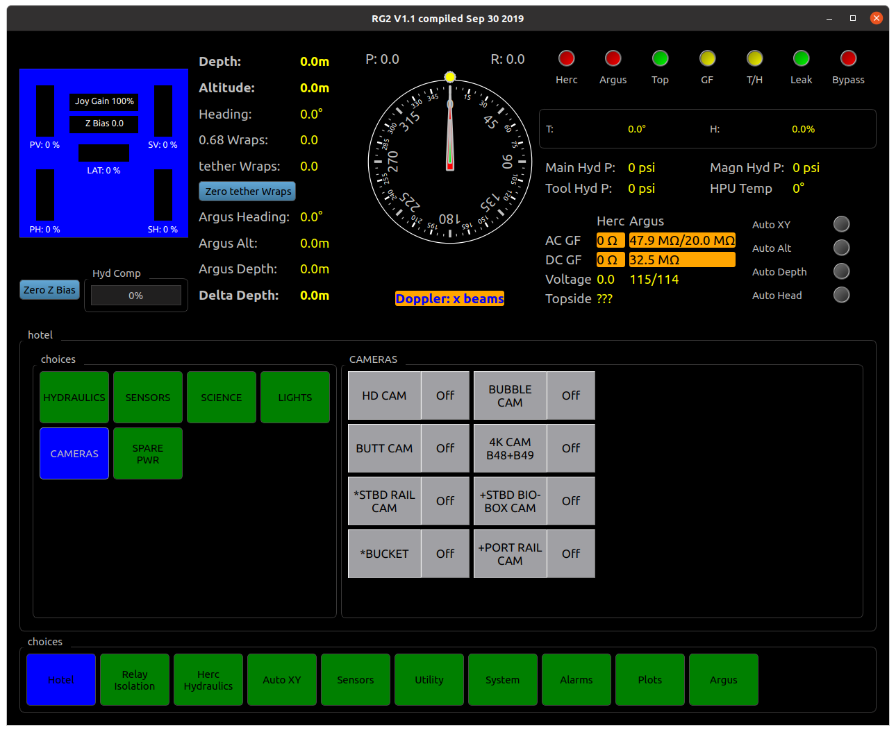
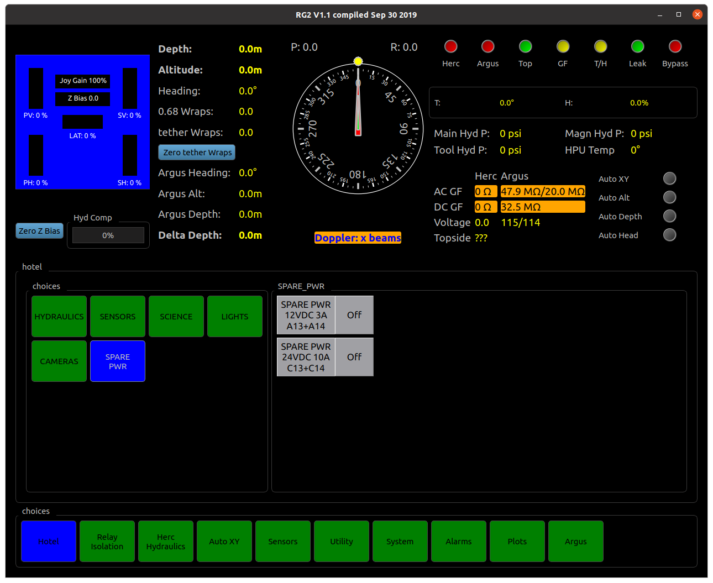

Operation
=========

This section gives an introduction to OET ROV Operation

- [] Create document tree
- [] Populate document tree

GUI
***

Dashboard
---------
**Shown at the top half of almost every page for at-a-glance system status.**

**Blue box shows thruster directions and forces. Click on percentages to cycle through %thrust, lbs force, and rpm.**

Depth, altitude, and heading readout:
	* Depth shown from Herc Paro
	* Altitude shown from Herc DVL. Reads 0.0 when DVL has zero beams
	* Heading shown from Herc Octans (unless manually set to show Herc TCM2, usually only used at launch if Octans is not yet stabilized.
	* 0.68 wraps and tether wraps should be set to zero just after launch. When vehicles are facing away from each other, wraps should read zero. Positive wraps indicate turns to starboard, turn to port to remove positive wraps.
	* Argus heading shown from selected AHRS (selected on Argus GUI page)
	* Argus Alt shown from Argus altimeter.
	* Argus Depth shown from Argus Paro
	* Delta Depth calculated from Paros
Compass Rose:
	- Large red compass needle indicates Herc heading
	- Yellow dot shows Herc Auto-heading setpoint
	- Small white compass needle indicates Argus heading
	- Careful, the compass rose shown on Argus page has the needles reversed.
Indicator lights:
	- Herc, Argus, and Top indicate communications to each vehicle and Topside,respectively
	- GF, Green indicates no ground fault on either vehicle, yellow indicates no recent update or small ground fault, and red indicates significant ground fault on at least one vehicle
	- T/H, Green indicates no temperature or humidity problems on either vehicle, yellow indicates no recent update and red indicates T or H problems on at least one vehicle
	- Leak, Green indicates no leak or no recent update, red indicates leak in a bottle or junction box on either vehicle
	- Bypass, Red indicates bypass is enabled, green means bypass is released and full pressure is enabled

**Temperature and Humidity show condition of Herc main bottle.**

**Hydraulic pressures are shown from the distribution manifold.**

Herc ground fault monitoring:
	- Green indicates ground fault at an acceptable level
	- Yellow indicates no recent update
	- Red indicates significant ground fault (<2MΩ acgf, <1MΩ dcgf)
Argus ground fault monitoring:
	- Green indicates ground fault at an acceptable level
	- Yellow indicates small ground fault (<5MΩ)
	- Red indicates significant ground fault (<2MΩ)

**Voltage shows hotel voltages of all main bottles**

**Topside shows voltage going into High Voltage cabinet**

**Autos indicators show status of Herc autos**

Hotel - Hydraulics page
-----------------------

Wandfluh A, B, and C enable buttons: 
	* Enables proportional hydraulic valves used for thrusters and spare proportional valves.

Kraft power button: 
	* Enables electrical power to Kraft manipulator

Kraft Valve: 
	* Opens high pressure hydraulic supply to Kraft manipulator

Thruster enable button: 
	* When off, joybox thruster controls are locked out

Bypass release: 
	* Enables full system pressure when pressed (releases bypass mode)

Hotel - Sensors page
--------------------

Buttons enable power to devices:
	* Octans Gyro
	* Mesotech Sonar
	* Sea King Sonar
	* Paroscientific Depth Sensor
	* Doppler Velociy Log (DVL)
	* USBL beacon

Hotel - Science page
--------------------

**Temperature probe, CTD, and Optode oxygen sensor are standard Herc equipment and should be powered on for every dive**

**Ethernet Bottle is standard Herc equipment and is only powered on when cruise-specific scientists gear is connected**

**Power for cruise-specific scientists gear will be shown on this page after being integrated**

Hotel - Lights page
--------------------

**Buttons enable power for lights and lasers**

Hotel - Cameras page
--------------------

**Buttons enable power for Zeus Plus HD camera, bubble camera, and four tooling cameras**

	* Tooling cameras marked with * or + share a signal path. Only one of each pair can be used at a time. For example, Stbd Rail and Bucket cannot both be used simultaneously. To enable one, ensure the other in the pair is powered off.

Hotel - Spare Power page
------------------------

**Buttons for spare power relays are stored on this page. When cruise-specific scientists gear is installed, the buttons are re-labelled and moved to Hotel Science page.**
