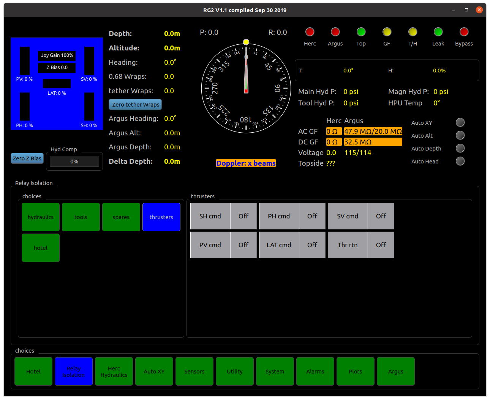
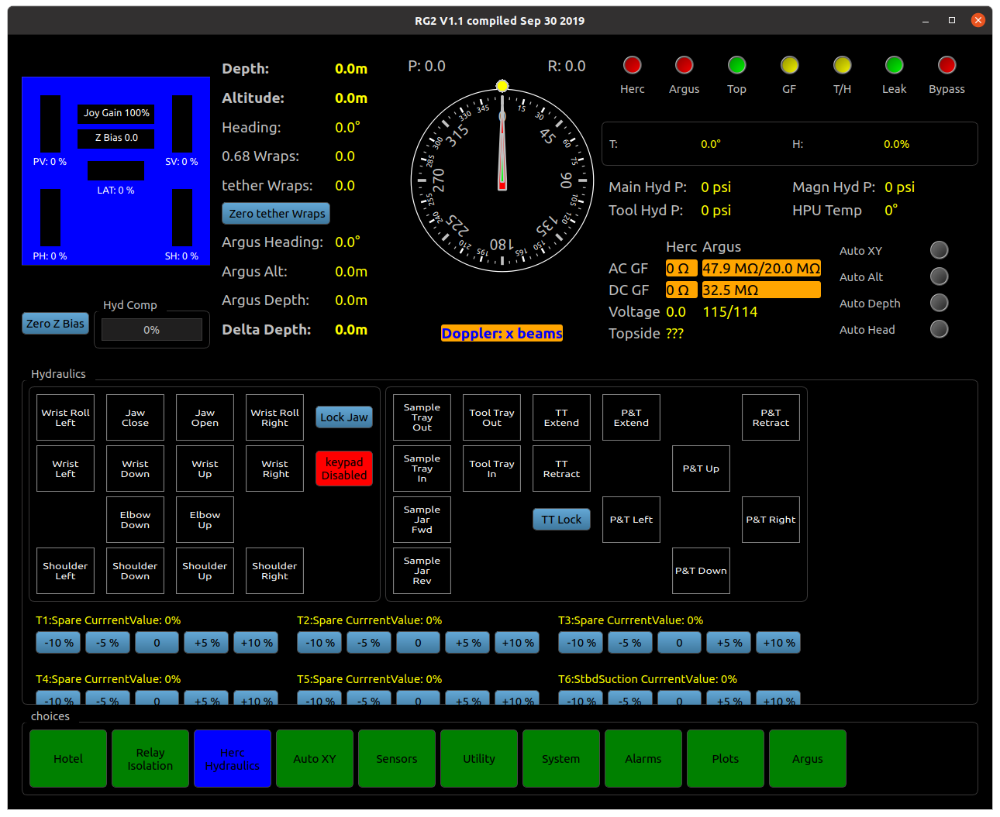
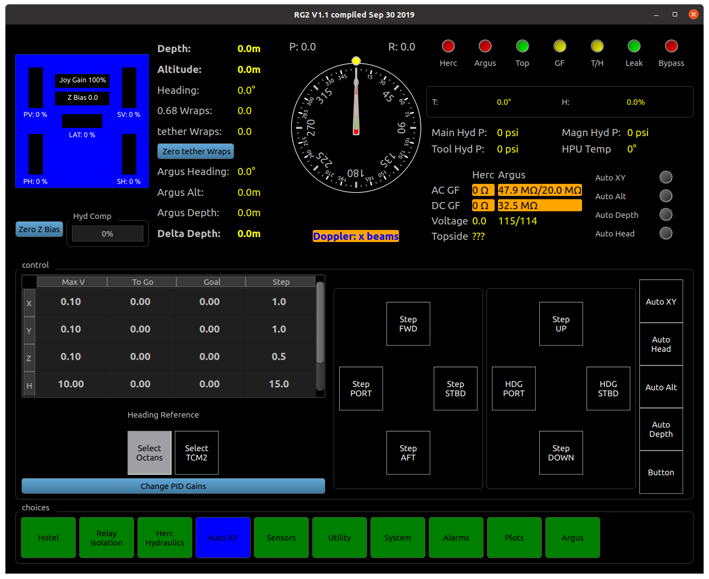
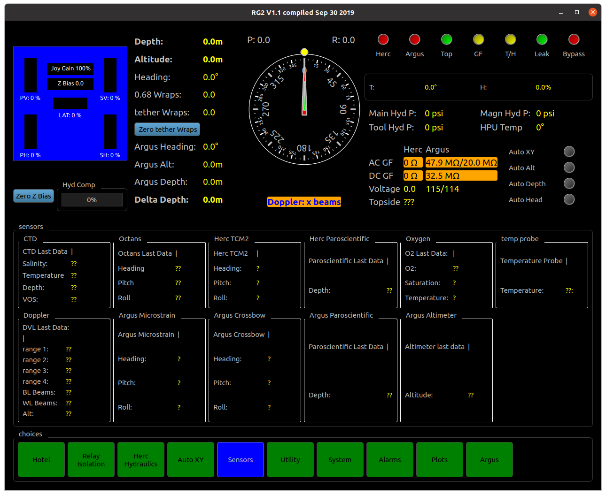
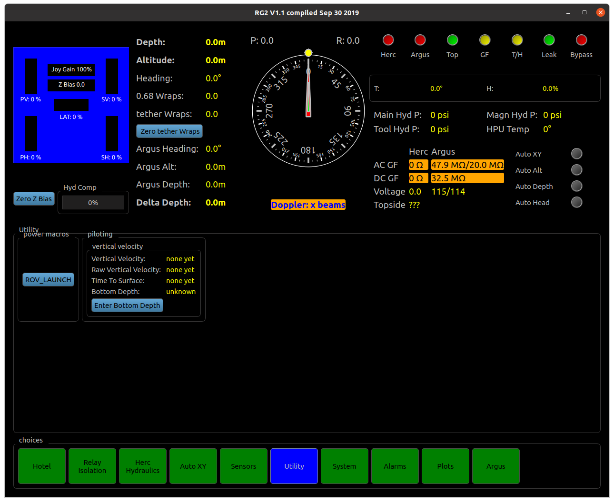
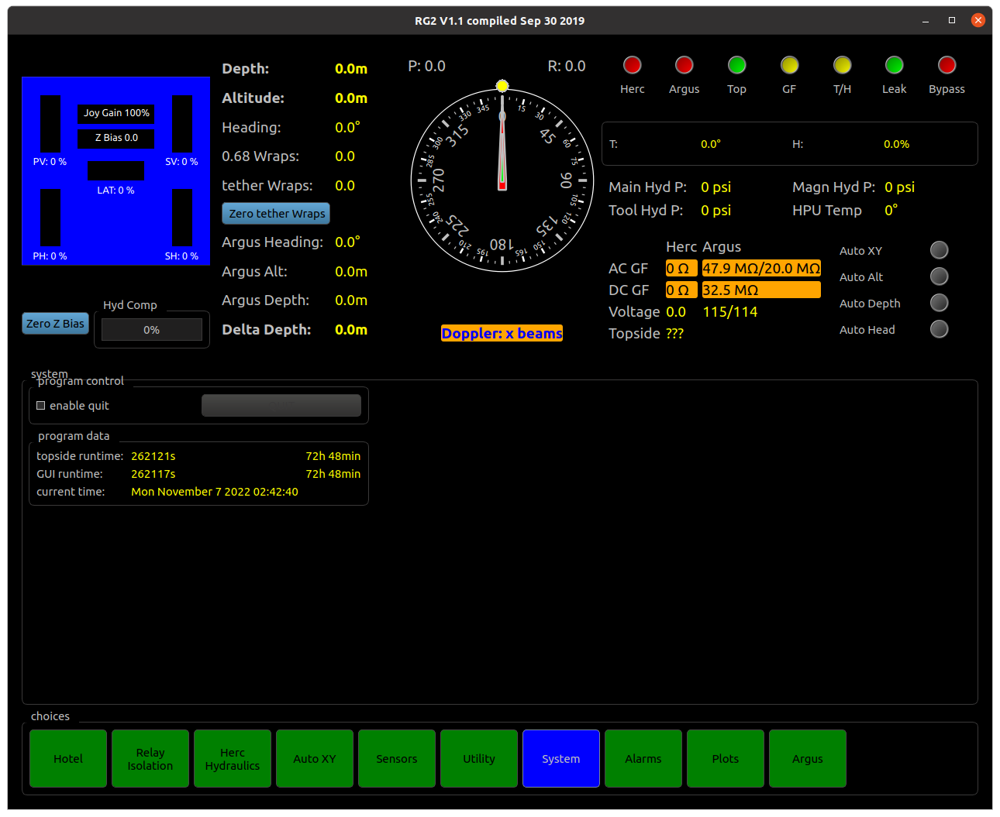
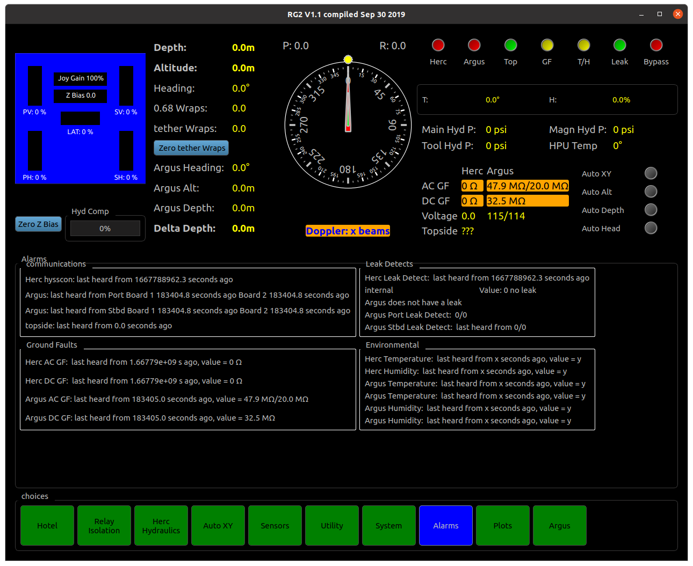
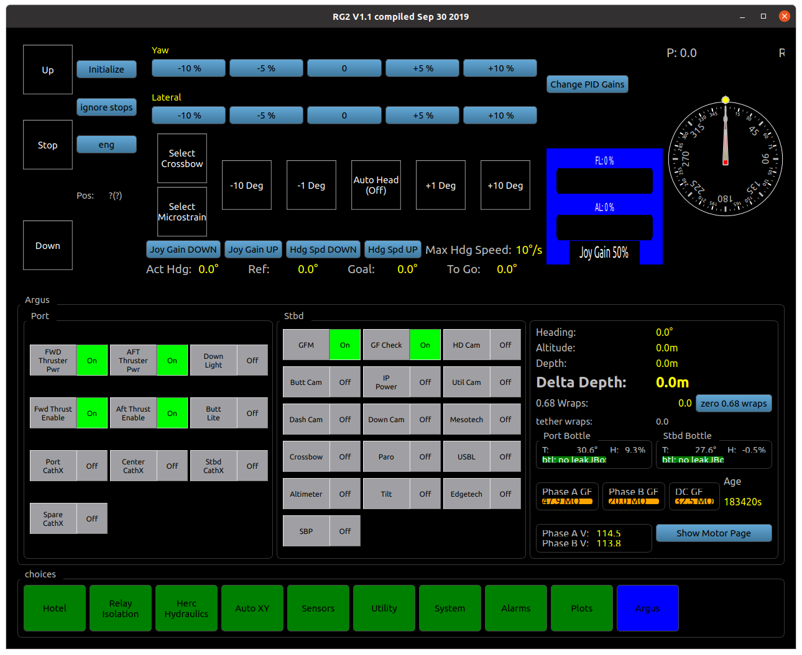

Operation
=========

This section gives an introduction to OET ROV Operation

- [] Create document tree
- [] Populate document tree

GUI
***

Dashboard
---------
**Shown at the top half of almost every page for at-a-glance system status.**

.. image:: _static/plots.png

**Blue box shows thruster directions and forces. Click on percentages to cycle through %thrust, lbs force, and rpm.**

Depth, altitude, and heading readout:
	* Depth shown from Herc Paro
	* Altitude shown from Herc DVL. Reads 0.0 when DVL has zero beams
	* Heading shown from Herc Octans (unless manually set to show Herc TCM2, usually only used at launch if Octans is not yet stabilized.
	* 0.68 wraps and tether wraps should be set to zero just after launch. When vehicles are facing away from each other, wraps should read zero. Positive wraps indicate turns to starboard, turn to port to remove positive wraps.
	* Argus heading shown from selected AHRS (selected on Argus GUI page)
	* Argus Alt shown from Argus altimeter.
	* Argus Depth shown from Argus Paro
	* Delta Depth calculated from Paros
Compass Rose:
	* Large red compass needle indicates Herc heading
	* Yellow dot shows Herc Auto-heading setpoint
	* Small white compass needle indicates Argus heading
	* Careful, the compass rose shown on Argus page has the needles reversed.
Indicator lights:
	* Herc, Argus, and Top indicate communications to each vehicle and Topside,respectively
	* GF, Green indicates no ground fault on either vehicle, yellow indicates no recent update or small ground fault, and red indicates significant ground fault on at least one vehicle
	* T/H, Green indicates no temperature or humidity problems on either vehicle, yellow indicates no recent update and red indicates T or H problems on at least one vehicle
	* Leak, Green indicates no leak or no recent update, red indicates leak in a bottle or junction box on either vehicle
	* Bypass, Red indicates bypass is enabled, green means bypass is released and full pressure is enabled

**Temperature and Humidity show condition of Herc main bottle.**

**Hydraulic pressures are shown from the distribution manifold.**

Herc ground fault monitoring:
	* Green indicates ground fault at an acceptable level
	* Yellow indicates no recent update
	* Red indicates significant ground fault (<2MΩ acgf, <1MΩ dcgf)
Argus ground fault monitoring:
	* Green indicates ground fault at an acceptable level
	* Yellow indicates small ground fault (<5MΩ)
	* Red indicates significant ground fault (<2MΩ)

**Voltage shows hotel voltages of all main bottles**

**Topside shows voltage going into High Voltage cabinet**

**Autos indicators show status of Herc autos**

Hotel - Hydraulics page
-----------------------

.. image:: _static/hotel_hydraulics.png

Wandfluh A, B, and C enable buttons: 
	* Enables proportional hydraulic valves used for thrusters and spare proportional valves.

Kraft power button: 
	* Enables electrical power to Kraft manipulator

Kraft Valve: 
	* Opens high pressure hydraulic supply to Kraft manipulator

Thruster enable button: 
	* When off, joybox thruster controls are locked out

Bypass release: 
	* Enables full system pressure when pressed (releases bypass mode)

Hotel - Sensors page
--------------------

.. image:: _static/hotel_sensors.png

Buttons enable power to devices:
	* Octans Gyro
	* Mesotech Sonar
	* Sea King Sonar
	* Paroscientific Depth Sensor
	* Doppler Velociy Log (DVL)
	* USBL beacon

Hotel - Science page
--------------------

.. image:: _static/hotel_science.png

**Temperature probe, CTD, and Optode oxygen sensor are standard Herc equipment and should be powered on for every dive**

**Ethernet Bottle is standard Herc equipment and is only powered on when cruise-specific scientists gear is connected**

**Power for cruise-specific scientists gear will be shown on this page after being integrated**

Hotel - Lights page
--------------------

.. image:: _static/hotel_lights.png

**Buttons enable power for lights and lasers**

Hotel - Cameras page
--------------------

.. image:: _static/hotel_cameras.png

**Buttons enable power for Zeus Plus HD camera, bubble camera, and four tooling cameras**

	* Tooling cameras marked with * or + share a signal path. Only one of each pair can be used at a time. For example, Stbd Rail and Bucket cannot both be used simultaneously. To enable one, ensure the other in the pair is powered off.

Hotel - Spare Power page
------------------------

.. image:: _static/hotel_sparepwr.png

**Buttons for spare power relays are stored on this page. When cruise-specific scientists gear is installed, the buttons are re-labelled and moved to Hotel Science page.**

Relay Isolation - Thrusters page
--------------------------------

**The realy isolation pages are mostly for advanced troubleshooting**

**Starboard Vertical (SV cmd) is sometimes isolated when stowing samples in Starboard Bio Box**

Herc Hydraulics page
--------------------

**The left section controls the ISE Magnum manipulator. Control can also be done using the remote keypad. When the keypad is not in use, ensure the keypad is disabled to prevent manipulator movement from accidentally bumping or dropping the keypad.**

**The Lock Jaw button secures the jaw by keeping constant pressure on the Jaw Close function. This lock button does not work if you are actively pressing Jaw Close on the remote keypad. Close the jaw, release the Jaw Close button, then press Lock Jaw.**

**Do not press multiple buttons simultaneously on the remote keypad. If not done in exactly the correct way, the functions can get stuck and the arm continues moving. If arm continues to move on its own, tap the direction of travel once to stop movement in that direction.**
	
**Other buttons control solenoid valves for various tooling on Herc, such as Tool Tray, Pan & Tilt (P&T), Tom Thumb (TT), etc.**

**The blue buttons control proportional valves. This is currently for the suction/dredge pump and 5 spare valves. The Wandfluhs need to be enabled to use the proportional valves (on the Hotel Hydraulics page)**

Auto XY page
--------------------

**The table controls velocity and step sizes for each auto X and Y velocities and step sizes are linked and cannot be independently adjusted.** 

**X, Y, and Z velocities are in m/s and steps are in m.**

**H velocity is in °/s and steps are in °**

**Keep in mind that entered max velocities are scaled to the percentage of joygain.**

**Herc heading reference can be changed from Octans to TCM2. This is usually only done if there is a problem with the Octans. This setting will persist even when power is cycled to the vehicle, so remember to switch it back.** 

**Auto XY and Auto Heading can be toggled on or off from this page, as well as from the joybox. Selecting between Auto Altitude and Auto Depth can only be done on this page, as the joybox has one button for both Autos.**

**For controls on this page to work, the "Button" button must be enabled.**

Sensors page
--------------------

**Sensor outputs and connectivity can be viewed on this page. There are no controls on this page.**
	
**Connectivity can be checked via the rotating dash mark next to "Last Data" in each sensor box. The dash rotates once for each new value it receives, which allows you to check connectivity and update frequency.**
	
**The DVL will not communicate with the GUI unless the Navest is also running. Ask a navigator to start Navest if you are seeing no connectivity during pre-dives.**

Utility page
--------------------

**The ROV_LAUNCH macro is used during launch to turn on cameras, sensors, hydraulic controls, and more with just one button. After this is pressed, bypass still must be released, the macro does not put the vehicle into full system pressure.**
	
**Vertical Velocity is used to match Herc and Argus descent/ascent speed**
	
**Enter Bottom Depth allows the automatic calculation of Time To Bottom (visible only on this page). Time To Surface is automatic without a bottom depth. This switches automatically based on Herc vertical direction.**

System page
--------------------

Exit the GUI by pressing the "enable quit" checkbox and clicking the "Quit" button.**

Alarm page
--------------------

**Ground fault, leak detects, and bottle environmental monitoring can be viewed on this page. There are no controls on this page.**

Argus page
--------------------

**The controls for the HD camera tilt are in the top left corner. Pre-dive and launch procedures are written out beside the control station so they don’t need to be memorised.**

**Heading reference selection is done with the Select Crossbow and Select Microstrain buttons.** 

**Auto heading control only functions once a heading reference is selected. Once auto heading is on, the setpoint can be controlled in increments of 1 or 10 degrees in either direction.**

**Yaw and Lateral sliders are primarily used during pre-dives to test thrusters.**

**The blue box shows percentage of maximum thrust. One direction will have a limit at ~62%. This is due to the directional efficiency of the thrusters – at maximum RPM, the reverse direction has a thrust force of 62% of the forward direction.**
	
Compass Rose:
	* Large red compass needle indicates Argus heading
	* Yellow dot shows Argus Auto-heading setpoint
	* Small white compass needle indicates Herc heading
	* Careful, the compass rose shown on all other pages has the needles reversed.

Argus Controls
--------------
	
**Thruster power buttons give power to thruster control modules**
	
**Thruster enable buttons allow thrusters to turn**
	
**Down and Butt Light buttons enable power to incandescent lights**
	
**CathX buttons enable power to the main LED lights**
	
**The spare CathX button enables power to the spare power whip (not connected)**
	
**GFM button enables power to the ground fault monitoring on Argus**
	
**GF Check button connects the main 24V return to the separate video 24V return to enable ground fault detection on the video circuits**
	
**HD Cam button powers the Zeus Plus camera**
	
**Down Cam and Util Cam are powered using their respective buttons**
	
**Dash Cam and Butt Cam are IP cameras. To enable, the power must be switched on to IP Power as well as their respective buttons**
	
**Buttons enable power to Mesotech sonar, Crossbow AHRS, Paroscientific depth sensor, USBL beacon, Altimeter, HD camera tilt motor Edgetech, and Sub Bottom Profiler. Edgetech is usually left powered off unless a dive specifically calls for it.**
	
Depth, altitude, and heading readout: 
	* Heading shown from currently selected Argus Attitude & Heading Reference System (AHRS)
	* Altitude shown from Argus altimeter. 
	* Depth shown from Argus Paro
	* Delta Depth calculated from Paros
	* 0.68 wraps and tether wraps should be set to zero just after launch. When vehicles are facing away from each other, wraps should read zero. Positive wraps indicate turns to starboard, turn to port to remove positive wraps.
	
**Bottle environmental monitoring checks temperature and humidity in each bottle**
	
Ground fault monitoring:
	* Green indicates ground fault at an acceptable level
	* Yellow indicates small ground fault (<5MΩ)
	* Red indicates significant ground fault (<2MΩ)
	
**Phase voltages show hotel voltage in each bottle**
	
**"Show Motor Page" button shows details about thruster motors. There are no controls on this popup.**
